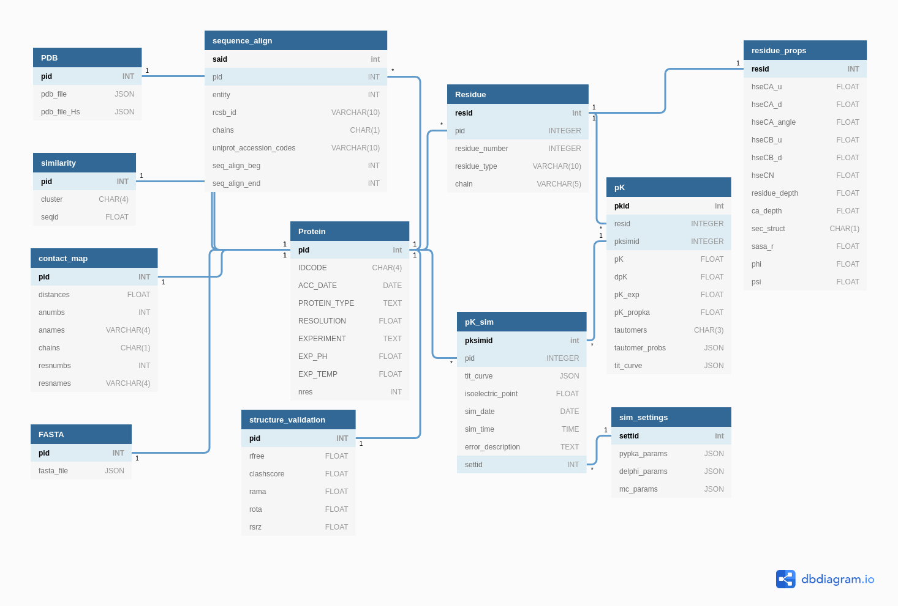

# PKPDB

A database of over 12M theoretical pKa values calculated over 120k protein structures deposited in the Protein Data Bank. DOI: <a href="https://doi.org/10.1093/bioinformatics/btab518">10.1093/bioinformatics/btab518</a>

While this repo contains all the necessary code to replicate pKPDB, you may download the full data from <a href="https://www.pypka.org/pKPDB">pypka.org/pKPDB</a>.

```bibtex
@article{reis2021pKPDB,
    author = {Reis, Pedro B. P. S. and Clevert, Djork-Arné and Machuqueiro, Miguel},
    title = "{pKPDB: a Protein Data Bank extension database of pKa and pI theoretical values}",
    journal = {Bioinformatics},
    year = {2021},
    month = {07},
    issn = {1367-4803},
    doi = {10.1093/bioinformatics/btab518}
}
```



# Create/Update Protein Data Bank proteins

dbs/init.sql contains the schema of the database

dbs/update_db.sh downloads the latest entries to the Protein Data Banks and inserts them into the database

```
cd initial/
psql -d pkpdb -f init.sql

cd PDB_data/
bash update_db.sh
```

mmseqs database of fasta files also needs to be updated

```
cd src/extra_properties/DB_PDB/
mmseqs databases PDB ./DB_PDB tmp
rm -rf tmp
```

# Add proteins to the database

```
# Add a random protein
python3 fill.py

# Add the protein with the IDCODE <IDCODE>
python3 fill.py --idcode <IDCODE>
```

Extra options:

- ncpus NCPUS
- verbose {DEBUG,INFO,WARNING}
- nres-limit NRES_LIMIT

# Dependencies

```
python3 -m pip install psycopg2-binary sqlalchemy pypka biopython python-decouple
```

[mmseqs](https://github.com/soedinglab/MMseqs2) and [DSSP](https://github.com/cmbi/dssp) are also required for running extra_properties/solvent_exposure.py
